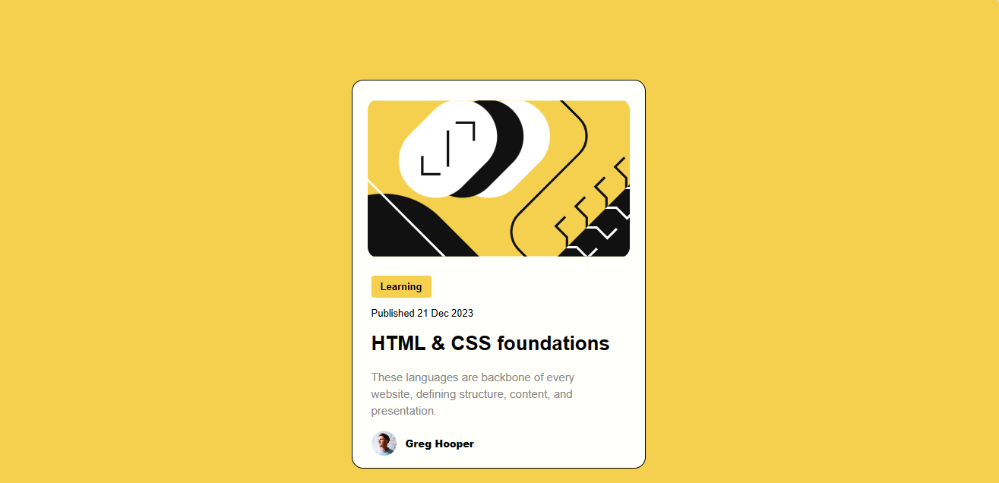

<h1 align="center">Projeto Card SISGHA</h1>

Demonstração do card

## 📄 Sobre o projeto
Esse projeto tem a finalidade de apresentar um exercício básico em HTML e CSS para entrega no SISGHA. Ele consiste em criar uma página web simples, exibindo um card que contém algumas informações, como imagem, descrição, título, etc.

## 💻 Ferramenta utilizada
- [Visual Studio Code](https://code.visualstudio.com/)

